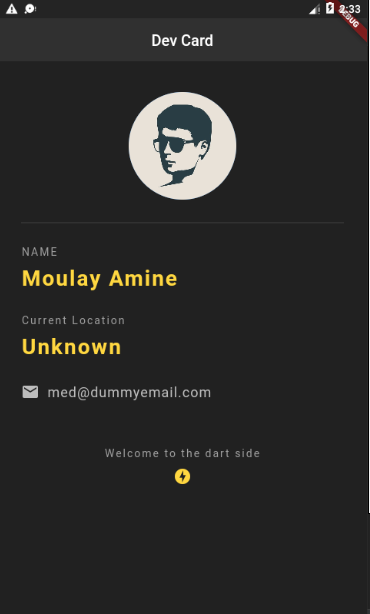
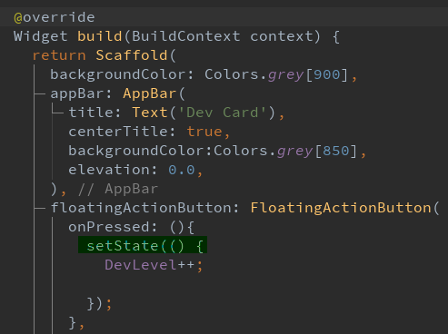
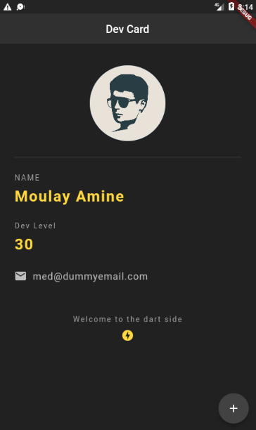

# Dev Card

A Simple Flutter application , (playing with rows and columns)

Using StatefulWidget so that we can change the state of Counter (Dev Level)

we used setState here for the rebuild so each time we pressed the plus button the state changed.

